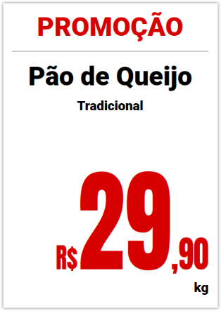
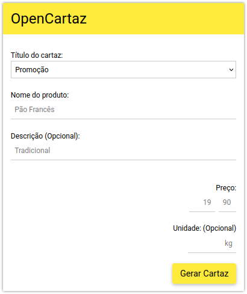

# OpenCartaz

Ferramenta web para gerar cartazes promocionais em formato A4, ideal para supermercados e comércios em geral.

A ferramenta funciona online, para acessa-la clique no link abaixo:

[https://codigoarte360.github.io/opencartaz](https://codigoarte360.github.io/opencartaz)

## Tela Principal

Para gerar o cartaz basta preencher as informações:

- **Título do cartaz** (Promoção, Oferta ou Sem Título)
- **Nome do produto**
- **Descrição** (Opcional)
- **Preço**
- **Unidade** (Opcional)

Após preencher, clique no botão **Gerar Cartaz**. O cartaz será gerado automaticamente e poderá ser impresso ou salvo como PDF.
